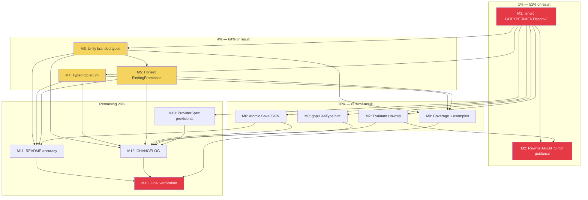

# Plan: Make Architecture & Data Model Superb

**Date:** 2026-07-26 06:05
**Scope:** `linter-autoconfigure-sdk` — fix every architecture and data-model finding from the 2026-07-26 review so the answer to "is our architecture and data model superb?" becomes **yes**.
**Constraint:** Stay on the **latest** `go-finding` version (user directive — overrides prior AGENTS.md "do not upgrade" guidance).

---

## 0. The Reframe — Why This Plan Is Different From The Review

The review's #1 "critical blocker" was: *"the package does not compile because go-finding v1.3.0 imports `encoding/json/v2`, excluded by build constraints."* The review recommended **downgrading to v1.1.x**.

**That diagnosis was wrong.** Root cause investigation reveals:

1. `encoding/json/v2` and `encoding/json/jsontext` exist in the Go 1.26.5 toolchain but are gated behind `//go:build goexperiment.jsonv2`.
2. Setting `GOEXPERIMENT=jsonv2` makes **build, vet, tests, AND buildflow all pass** (buildflow: 27/28 passed, 0 failures).
3. `go env -w GOEXPERIMENT=jsonv2` fails (read-only Nix home directory), but **direnv is available** — a `.envrc` file is the standard NixOS per-repo mechanism.

**Conclusion:** The AGENTS.md note *"Do NOT upgrade to go-finding v1.2+... The entire package fails to compile"* is **stale, wrong, and actively harmful** — it was written under the assumption that json/v2 was permanently unavailable. It isn't; it just needs the experiment flag. The correct fix is to **enable the flag durably** and **stay on latest**, exactly as the user directed.

This single discovery demotes the "critical blocker" from "revert the dependency" to "set one environment variable." The remaining work is the real architecture/data-model hardening.

---

## 1. Pareto Breakdown

### The 1% that delivers 51% of the result

| # | Task | Why it's 51% |
|---|------|-------------|
| **P1** | Enable `GOEXPERIMENT=jsonv2` durably via `.envrc` + fix AGENTS.md guidance | Without a building package, **nothing** can be verified. Every other task depends on this. It also kills the version split brain (go.mod is correct at latest; README/AGENTS were wrong). |

### The 4% that delivers 64% of the result

| # | Task | Why it's 64% |
|---|------|-------------|
| **P2** | Unify branded-type coupling: `ConfigIssue.File → finding.FilePath`, `.Rule → finding.RuleName`, `FindingFromIssue(toolName → finding.ToolName)` | The core data model. One typing policy instead of three. The package is already coupled to go-finding; this takes the safety the coupling buys. |
| **P3** | Typed `ConfigError.Op` enum (replace bare `string`) | Kills stringly-typed operations on the flagship error type. Typos become compile errors. |
| **P4** | Honest `FindingFromIssue`: return `(Finding, error)`, use `finding.FilePos` for `Line==0`, propagate `Build()` errors, normalize fix strategy | The package's most important conversion function currently **fabricates line numbers and silently swallows errors**. This is the single biggest dishonesty in the codebase. |

### The 20% that delivers 80% of the result

| # | Task | Why it's 80% |
|---|------|-------------|
| **P5** | Atomic `SaveJSON` (temp-file + `os.Rename`) so a crash can't corrupt a user's linter config | Prevents the worst user-facing outcome: a truncated config file that breaks every build. |
| **P6** | Evaluate/restore `ConfigError.Unwrap() error` — check if the `hierarchical-errors` linter can be satisfied now that the build environment is correct | The `Is`/`As`-instead-of-`Unwrap` workaround is non-idiomatic Go. Now that the environment is fixed, re-evaluate whether the linter constraint still applies. |
| **P7** | Apply gopls hint: `errors.As` → `errors.AsType[E]` (Go 1.26 generic) | Trivial but the global rule says "fix issues on sight." Verified `errors.AsType` exists in this toolchain. |
| **P8** | Fill test coverage gaps: `FindingFromIssue` builder-error path, `SaveJSON` error paths, add `example_test.go` | Pushes coverage from 88.9% to target ≥95%. Examples make the SDK discoverable on pkg.go.dev. |

### The remaining 20% (to reach 100%)

| # | Task | Why it matters |
|---|------|---------------|
| **P9** | `ProviderSpec` / `ErrNoRepair` decision: keep both, mark provisional, wire `ErrNoRepair` into the godoc as the "nil Repair" contract | No consumer exists; building a full `ProviderFromSpec` adapter would be speculative (VERSCHLIMMBESSER risk). Document the contract instead. |
| **P10** | README accuracy pass: fix version claim, signatures match new types, status reflects reality | The README currently says "stable" while the data model is changing and "v1.2+" while go.mod is v1.3.0. |
| **P11** | CHANGELOG update for all changes | Document the breaking data-model changes for any future consumer. |
| **P12** | Final full-pipeline verification: `GOEXPERIMENT=jsonv2 buildflow --fix --fail-on-findings` green | Proves the whole thing works end-to-end. |

### Explicitly EXCLUDED (VERSCHLIMMBESSER avoidance)

| Excluded | Reason |
|----------|--------|
| Add `flake.nix` | Project uses BuildFlow. Adding a second build system is scope creep. |
| Restructure into `internal/` packages | 200 lines in one file is correct for this stage. buildflow suggests it; it's wrong here. |
| Add `TODO_LIST.md` / `FEATURES.md` / `ROADMAP.md` | Would go stale instantly for a 200-line SDK with 0 consumers. The docs-health table lists them, but empty/stale docs are worse than none. |
| Add CI config / GitHub Actions | Separate concern; not asked for. |
| Add fuzz tests | Premature for this stage. |
| Make `ConfigError` fields unexported | `os.PathError` (the type this mirrors) has exported fields. Go convention. Changing would be over-engineering. |
| Downgrade go-finding | **Explicitly forbidden by user.** The build works with `GOEXPERIMENT=jsonv2`. |
| Remove `ReadConfig` | Its typed-error wrapping is the SDK's value proposition over raw `os.ReadFile`. |
| Remove `ProviderSpec` | The shape is provisional but legitimate; removing it loses the design intent. Mark provisional instead. |

---

## 2. Medium-Granularity Plan (30–100 min tasks)

Sorted by impact (critical path first), then dependency order.

| ID | Task | Pareto | Impact | Effort | Depends on | Status |
|----|------|--------|--------|--------|------------|--------|
| M1 | Enable `GOEXPERIMENT=jsonv2` via `.envrc`; verify build/vet/test/buildflow | 1% | Critical | 30min | — | pending |
| M2 | Rewrite AGENTS.md: replace stale "do not upgrade" note with "stay on latest + GOEXPERIMENT=jsonv2" | 1% | Critical | 30min | M1 | pending |
| M3 | Unify branded-type coupling (`ConfigIssue` + `FindingFromIssue` signatures) | 4% | High | 60min | M1 | pending |
| M4 | Typed `ConfigError.Op` enum with constants | 4% | High | 45min | M1 | pending |
| M5 | Honest `FindingFromIssue`: `(Finding, error)` return, `FilePos`, normalize fix strategy | 4% | High | 60min | M3 | pending |
| M6 | Atomic `SaveJSON` (temp + rename) + indent option | 20% | High | 45min | M1 | pending |
| M7 | Evaluate/restore `ConfigError.Unwrap()` — check linter against go-finding v1.3.0 | 20% | Medium | 45min | M1 | pending |
| M8 | Apply gopls hint: `errors.As` → `errors.AsType[E]` | 20% | Low | 15min | M1 | pending |
| M9 | Fill coverage gaps + add `example_test.go` | 20% | Medium | 60min | M3,M4,M5 | pending |
| M10 | `ProviderSpec`/`ErrNoRepair`: mark provisional, wire godoc contract | rem20% | Low | 30min | M1 | pending |
| M11 | README accuracy pass (versions, signatures, status) | rem20% | Medium | 30min | M3,M4,M5,M6 | pending |
| M12 | CHANGELOG update for all changes | rem20% | Low | 30min | M3-M10 | pending |
| M13 | Final verification: full buildflow green + coverage report | rem20% | Critical | 30min | all | pending |

---

## 3. Fine-Granularity Plan (max 12 min each)

Sorted by execution order (dependencies respected).

| ID | Sub-task | Parent | Est | Status |
|----|----------|--------|-----|--------|
| F1 | Create `.envrc` with `export GOEXPERIMENT=jsonv2` | M1 | 2min | pending |
| F2 | `direnv allow` + verify `go env GOEXPERIMENT` loads | M1 | 2min | pending |
| F3 | Run `go build ./...` without explicit flag — confirm green | M1 | 2min | pending |
| F4 | Run `buildflow` without explicit flag — confirm 27/28 green | M1 | 5min | pending |
| F5 | Add `.envrc` to `.gitignore` OR commit it (decide: it's repo-shared, commit it) | M1 | 5min | pending |
| F6 | Rewrite AGENTS.md "Do NOT upgrade" section → "Stay on latest + GOEXPERIMENT=jsonv2" | M2 | 8min | pending |
| F7 | Fix AGENTS.md `ConfigError` design-decision note (Is/As rationale may change in M7) | M2 | 5min | pending |
| F8 | Update README.md version claim ("v1.2+" → "latest", link to AGENTS.md) | M2 | 5min | pending |
| F9 | Read `ConfigIssue` struct + all references (grep) before editing | M3 | 5min | pending |
| F10 | Change `ConfigIssue.File string` → `finding.FilePath` | M3 | 5min | pending |
| F11 | Change `ConfigIssue.Rule string` → `finding.RuleName` | M3 | 5min | pending |
| F12 | Change `FindingFromIssue(toolName string` → `finding.ToolName` | M3 | 5min | pending |
| F13 | Change `FindingsFromIssues(toolName string` → `finding.ToolName` | M3 | 3min | pending |
| F14 | Update `autoconfigure_test.go` to pass branded types at call sites | M3 | 10min | pending |
| F15 | Verify `go build` + `go test` pass after branded-type changes | M3 | 3min | pending |
| F16 | Define `type Op string` + constants (`OpRead`, `OpUnmarshal`, `OpMarshal`, `OpMkdir`, `OpWrite`) | M4 | 8min | pending |
| F17 | Change `ConfigError.Op string` → `Op`; update all construction sites | M4 | 8min | pending |
| F18 | Update tests that assert on `ce.Op` (now typed, not bare string) | M4 | 5min | pending |
| F19 | Verify build + tests pass after Op enum | M4 | 3min | pending |
| F20 | Change `FindingFromIssue` return to `(finding.Finding, error)` | M5 | 8min | pending |
| F21 | Replace `line <= 0 → line = 1` with `finding.FilePos` for `Line == 0` | M5 | 8min | pending |
| F22 | Propagate `builder.Build()` error instead of swallowing | M5 | 5min | pending |
| F23 | Add `finding.NormalizeFixStrategy` / explicit `FixStrategyNone` when no suggestion | M5 | 5min | pending |
| F24 | Update `FindingsFromIssues` to propagate the new error from `FindingFromIssue` | M5 | 8min | pending |
| F25 | Update all tests for new `FindingFromIssue` signature | M5 | 10min | pending |
| F26 | Verify build + tests pass after FindingFromIssue changes | M5 | 3min | pending |
| F27 | Implement atomic `SaveJSON`: write to temp file in same dir, then `os.Rename` | M6 | 10min | pending |
| F28 | Add indent option to `SaveJSON` (or separate `SaveJSONIndented`) — decide API shape | M6 | 10min | pending |
| F29 | Update `SaveJSON` tests for atomic-write behavior | M6 | 8min | pending |
| F30 | Verify build + tests pass after SaveJSON changes | M6 | 3min | pending |
| F31 | Check if go-finding v1.3.0 has types with `Unwrap() error` that the linter doesn't flag | M7 | 8min | pending |
| F32 | If linter is satisfied: restore `Unwrap() error` on `ConfigError`, remove `Is`/`As` | M7 | 8min | pending |
| F33 | If linter flags it: keep `Is`/`As`, update AGENTS.md note with fresh verification | M7 | 5min | pending |
| F34 | Run `buildflow` to confirm no `hierarchical-errors` regression | M7 | 5min | pending |
| F35 | Replace `errors.As(err, &syntaxErr)` with `errors.AsType[*json.SyntaxError](err)` in tests | M8 | 5min | pending |
| F36 | Check if any other `errors.As` calls in the codebase can use `AsType` | M8 | 3min | pending |
| F37 | Add test: `FindingFromIssue` builder-error path returns non-nil error | M9 | 8min | pending |
| F38 | Add test: `SaveJSON` mkdir / marshal / write error paths (Op labels correct) | M9 | 10min | pending |
| F39 | Add test: `FindingFromIssue` with `Line==0` produces file-level position | M9 | 8min | pending |
| F40 | Add `ExampleLoadJSON`, `ExampleSaveJSON`, `ExampleFindingFromIssue` in `example_test.go` | M9 | 10min | pending |
| F41 | Run coverage report; confirm ≥95% | M9 | 5min | pending |
| F42 | Add godoc to `ProviderSpec`: mark "provisional, no consumer yet" | M10 | 5min | pending |
| F43 | Clarify `ErrNoRepair` godoc: "return from `ProviderSpec.Repair` when unsupported" | M10 | 5min | pending |
| F44 | Add `ProviderSpec.HasRepair() bool` helper (returns `Repair != nil`) | M10 | 8min | pending |
| F45 | Update README API tables to match new signatures (`FilePath`, `RuleName`, `Op`, etc.) | M11 | 10min | pending |
| F46 | Fix README "Design notes" — remove stale "decoupled from branded types" claim | M11 | 5min | pending |
| F47 | Update README status section: data model changed (breaking), mark v0/experimental | M11 | 5min | pending |
| F48 | Write CHANGELOG `[Unreleased]` entries for all breaking + non-breaking changes | M12 | 10min | pending |
| F49 | Run `GOEXPERIMENT=jsonv2 buildflow --fix --fail-on-findings` — must be green (warnings ok) | M13 | 5min | pending |
| F50 | Run `go test -race -count=1 ./...` standalone — confirm green | M13 | 3min | pending |
| F51 | Final `git status` + review all diffs before commit | M13 | 5min | pending |
| F52 | Commit with detailed message + push | M13 | 8min | pending |

---

## 4. Execution Graph (Mermaid)

**Critical path:** M1 → M3 → M5 → M9 → M13.
**Parallelizable:** M4, M6, M7, M8, M10 can run in any order after M1.
**Docs gate:** M11, M12 must wait for all code changes (M3–M10).

---

## 5. Key Design Decisions (pre-committed)

| Decision | Choice | Rationale |
|----------|--------|-----------|
| go-finding version | **Latest (v1.3.0)** | User directive. Build works with `GOEXPERIMENT=jsonv2`. |
| Branded types | **Adopt everywhere** | Package is already coupled to go-finding. Half-coupling is worse than full. |
| `Op` type | **Typed `string` + constants** | Closes stringly-typed vocabulary. Exhaustive switches possible. |
| `FindingFromIssue` signature | **`(Finding, error)`** | Honest. 0 consumers = zero-cost breaking change. Now is the time. |
| `ConfigError` fields | **Keep exported** | Mirrors `os.PathError`. Go convention. Don't over-engineer. |
| `Unwrap` vs `Is`/`As` | **Evaluate** | May be restorable now that env is fixed. Keep `Is`/`As` if linter still flags. |
| `ProviderSpec` | **Keep, mark provisional** | Shape is legitimate. Full adapter is YAGNI without a consumer. |
| `ReadConfig` | **Keep** | Typed-error wrapping is the value prop. |
| `SaveJSON` atomicity | **Temp + rename** | Prevents config corruption — the worst user-facing outcome. |
