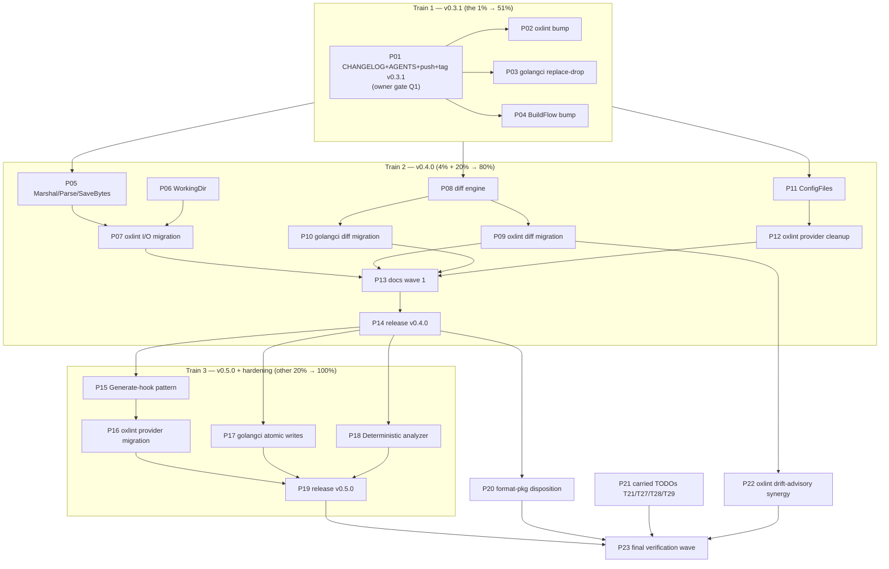

# SDK Absorption Masterplan — linter-autoconfigure-sdk

_Date: 2026-09-22 23:48 CEST · Repo: `linter-autoconfigure-sdk` (master, v0.3.0 tagged, 2 unpushed daemon commits)_
_Trigger: owner demanded actual research + proper plan for absorbing what `oxlint-auto-configure` (and `golangci-lint-auto-configure`) still hand-roll._
_Evidence base: full reads of both consumer repos, BuildFlow go.mods, go-finding v1.13 + go-atomic-write v0.5.1 API surfaces, SDK git history/tags, oxlint session report 2026-09-22_23-16._

---

## 1. Research findings (all verified, with sources)

### 1.1 SDK state

- `v0.3.0` tagged 2026-09-22 (`a4f9203`): go 1.27 floor, go-finding v1.13.0. **CHANGELOG has NO `[0.3.0]` section** (release commit touched only go.mod/go.sum).
- **2 unpushed daemon commits** (`fc9aacf`, `d872d1e`) = the `SaveJSON` determinism fix (`json.Deterministic(true)`) + bite-proven regression test `TestSaveJSON_DeterministicMapKeyOrdering`. Unreleased, un-changelogged, un-pushed.
- TODO_LIST `T26` ("cut v0.2.0, drop replaces") is stale: v0.2.0 AND v0.3.0 exist; oxlint pins `v0.2.0` with NO replace; golangci pins `v0.2.0` WITH local replace (`go.mod:68`).
- AGENTS.md stale: documents `go 1.26.7` floor + `GOEXPERIMENT=jsonv2` requirement; go.mod is `go 1.27` (jsonv2 standard) — the env note is obsolete.
- Missing APIs (gap analysis, confirmed against both consumers): `MarshalJSONIndented`, `ParseJSON[T]`, `SaveJSONBytes`, `WorkingDir(ctx)`, `ProviderSpec.ConfigFiles`, generic diff engine, `Generate`-hook provider pattern.

### 1.2 Consumer duplication (the absorption targets)

| # | Duplicated plumbing | oxlint-auto-configure | golangci-lint-auto-configure | SDK state |
|---|---------------------|------------------------------------------------------|-----------|
| D1 | Deterministic-indented marshal options | `pkg/config/generator.go:97` ToJSON; `pkg/format/format.go:148` | internal (report writers) | options exist only inside `SaveJSON` — not reusable |
| D2 | Atomic config write | `atomicwrite.Write + '\n'` hand-rolled ×2 (`internal/cli/cmd_configure.go:293`, `pkg/provider/provider.go:300`) | **plain non-atomic `os.WriteFile`** (`pkg/config/loader.go:460` via fs abstraction) | `SaveJSON` unusable for both (no bytes-in, no trailing newline) |
| D3 | Byte-level JSON parse + error shape | `config.FromJSON` (`generator.go:112`) + raw `os.ReadFile` ×3 sites | own Loader | `LoadJSON` is path-coupled; no `ParseJSON[T]` |
| D4 | `WorkingDirFromContext` + `"."` fallback | `pkg/provider/provider.go:68` (comment: "mirroring the other BuildFlow providers") | n/a (not a toolsdk provider) | absent; also absent in go-finding/toolsdk |
| D5 | Multi-candidate config discovery | `oxlintConfigFiles` + `hasConfig` (`provider.go:59-92`) + forced `spec.Inputs` override (`provider.go:123`) | n/a | `ProviderSpec.ConfigFile` is single-file only |
| D6 | Config diff engine | `pkg/diff`: `Change{Rule,Old,New,Kind-string}` + comparators + Summary/FormatDiff | `pkg/diff/differ.go:13-41`: `Change{Type-int,Path,Old,New,Description}` — **confirmed split brain** | absent |
| D7 | Bootstrap-missing-config provider pattern | ~150 lines `provider.go:138-262` (Detect-missing / never-overwrite Repair / dry-run / advisory drift HealthCheck) | n/a (BuildFlow CLI step, not toolsdk) | `ProviderSpec` has only Analyze/Repair |

Not SDK material (verified): SARIF + Report JSON (go-finding owns: `report.ToSARIF()`, `PrettyJSON()`); pipeline (go-finding `pipeline`); `pkg/format` rendering is go-finding-generic but not config-plumbing → disposition task P20; oxlint `Differ` field projection is domain and stays (~40 lines after D6).

### 1.3 Peer API surfaces (no duplication risk)

- **go-atomic-write v0.5.1**: `Write`, `WriteWithPerm`, `WriteVerified`, `WriteIfChanged`, `WriteFunc(Verified)`, `Fingerprint*`. No newline handling — the trailing-newline contract must live in the SDK.
- **go-finding v1.13.0**: marshal opts (`marshalOpts`/`prettyMarshalOpts`) are **unexported** (`json.go:12-20`) — SDK cannot reuse; a shared exported helper would be an upstream proposal (out of scope, noted in P20). toolsdk exports `OnFiles/OnGoFiles/OnGoModule/AnyLanguage`, `Register/All`, `WithDryRun/DryRunFromContext`, `EnsureContext` — no `WorkingDir` fallback helper (D4 confirmed absent upstream).
- **BuildFlow**: pins SDK `v0.2.0` as **indirect** only (`tools/go.mod:129`, `execution/go.mod:147`) — API changes have near-zero BuildFlow blast radius; only version resolution matters.

### 1.4 Cross-repo blockers/queues discovered

- oxlint session report `2026-09-22_23-16` section f items 1-5 ("SDK fix adoption"): exactly this plan's release train 1. Its v0.7.0 gate is green but waiting; owner question g1 (release timing) is OPEN — **do not tag without owner** (see §7).
- oxlint report f-items that become trivial after D6: #15 (validate-side drift advisory), #24 (Deterministic enforcement → P18), #35 (ConfigWriter extraction → P07), #41 (second SDK consumer story → P15/P16).
- oxlint owner question g3 (`errConfigDrift` export?) — folded into P15 design (SDK-level drift sentinel decision).

---

## 2. Pareto breakdown

**Goal:** the SDK actually owns the plumbing its README claims; consumers stop re-implementing it; releases ship.

### The 1% that delivers 51%

**Ship the already-coded determinism fix as `v0.3.1`** (P01-P04): CHANGELOG entry + `[0.3.0]` backfill + AGENTS policy/refresh + push + tag + three consumer bumps.
Why this is half the result: the code is finished and bite-proven; it unblocks oxlint v0.7.0 (byte-stable configs = silent VCS-diff fix); it re-opens the tag→bump pipeline T26 wanted; it closes the replace-drop half of stale T26; and every later item builds on a released foundation instead of drifting master. ~4h total.

### The 4% that delivers 64% (cumulative)

**SDK I/O matrix completion + oxlint migration of its hand-rolled sites** (P05-P07): `MarshalJSONIndented` + `ParseJSON[T]` + `SaveJSONBytes` + `WorkingDir`, then migrate `ToJSON`/`FromJSON`/`writeConfig`×2.
Why: four copies of marshal options → one; two atomicwrite bypasses → SDK writes; the SDK's flagship APIs get their first real consumers. This is the smallest API surface with the largest duplication kill.

### The 20% that delivers 80% (cumulative)

**Diff engine + ConfigFiles + v0.4.0** (P08-P14): generic `Change`/comparators engine (kills the confirmed oxlint↔golangci split brain, both migrated), `ProviderSpec.ConfigFiles` multi-candidate, oxlint provider cleanup, docs wave, release.
At this point every "reinvented identically" row in the README's table is SDK-owned by at least one consumer.

### The other 20% to reach 100% (P15-P23)

`Generate`-hook bootstrap-provider pattern + oxlint provider migration (v0.5.0), golangci deep migration (atomic writes via SDK), `Deterministic(true)` enforcement analyzer, format-package disposition (go-finding proposal), carried TODOs T21/T27/T28/T29, final cross-repo verification wave.

---

## 3. Comprehensive plan — 30-100 min tasks (sorted by importance / impact / effort / customer-value)

Sorted: release-unblocking first, then duplication-kill by leverage, then riskier pattern work, then carried smalls.

| ID | Task | Repo | Importance | Impact | Effort | Time | Depends on |
|----|------|------|-----------|--------|--------|------|------------|
| P01 | v0.3.1 release train: CHANGELOG `Unreleased→Fixed` determinism entry + backfill `[0.3.0]`; AGENTS marshal-policy line + go 1.27 refresh; push master; annotated tag `v0.3.1`; proxy + clean-dir `go get` verify | SDK | Critical | High | S | 60m | owner OK (§7 Q1) |
| P02 | Bump to SDK v0.3.1: `go get` + flake input tag + `vendorHash` + vendor regen + `validatePrivateDeps` + pre-release gate (unblocks v0.7.0) | oxlint | Critical | High | M | 60m | P01 |
| P03 | Drop local `replace`, `go get` v0.3.1, verify `FindingFromIssue` validate path | golangci | High | Medium | S | 30m | P01 |
| P04 | Bump indirect SDK v0.3.1 (tools + execution go.mod), verify provider resolution | BuildFlow | Medium | Medium | S | 30m | P01 |
| P05 | SDK I/O matrix: `MarshalJSONIndented(v)` (shared opts var), `ParseJSON[T](data)`, `SaveJSONBytes(path, data)` (WriteIfChanged + trailing-newline contract, `Op` coverage); refactor `SaveJSON` onto the shared helper; unit tests + 3 godoc examples | SDK | Critical | High | M | 90m | — |
| P06 | SDK `WorkingDir(ctx) string` helper (`WorkingDirFromContext` + `"."` fallback) + tests + example | SDK | High | Medium | S | 30m | — |
| P07 | Migrate oxlint I/O onto P05/P06: `ToJSON`→SDK marshal, `FromJSON`→`ParseJSON`, `writeConfig` + `writeConfigFile`→`SaveJSONBytes`; drop direct go-atomic-write import; golden-byte test pins output BEFORE migration | oxlint | Critical | High | M | 75m | P05 |
| P08 | SDK generic diff engine: `Change{Kind,Path,Old,New}` (drop `Unchanged` dead state), `DiffMaps`, `DiffSets`, value stringify (bare strings / deterministic JSON), order-insensitive blob-set compare, `Summary`, `FormatDiff` (+/-/~); golden tests | SDK | Critical | High | L | 100m | — |
| P09 | Migrate oxlint `pkg/diff` onto engine: `Differ` becomes ~40-line field projection; `Change.Rule`→`Path` rename ripple (provider `healthCheckDrift`, `cmd_configure` diff view, tests); delete local comparators | oxlint | High | High | M | 75m | P08 |
| P10 | Migrate golangci `pkg/diff` onto engine: int `ChangeType`→SDK `Kind`, `Description`→derived formatting; fix consumers (`cmd_configure_fixer.go`, report paths) | golangci | High | Medium | M | 90m | P08, P14 |
| P11 | SDK `ProviderSpec.ConfigFiles []FilePath` + `FirstExisting(root)` helper + `Inputs` derivation; single `ConfigFile` deprecation path decided for v1; validation + tests | SDK | High | Medium | M | 60m | — |
| P12 | Oxlint provider onto `ConfigFiles`: delete `oxlintConfigFiles`/`hasConfig` + forced `Inputs` override | oxlint | Medium | Medium | S | 30m | P11 |
| P13 | SDK docs wave 1: README API tables + design notes, `FEATURES.md`, `example_test.go` for all new APIs, TODO_LIST refresh (close T26 remainder), ROADMAP graduation | SDK | High | Medium | S | 60m | P05-P11 |
| P14 | SDK `v0.4.0` release: changelog cut, tag, proxy verify, oxlint + golangci bumps | SDK | Critical | High | S | 60m | P05-P13 |
| P15 | SDK `Generate`-hook provider pattern: `ProviderSpec.Generate func(ctx)`; SDK owns Detect-missing / never-overwrite Repair (dry-run aware) / advisory drift HealthCheck (built on P08); decide drift-sentinel export (oxlint g3); contract tests ported from oxlint `provider_test.go` | SDK | High | High | L | 100m | P08, P11 |
| P16 | Oxlint provider onto Generate-hook: delete ~150 lines; keep Trigger layering; `provider_test.go` must pass semantically unchanged | oxlint | High | High | M | 75m | P15, P14 |
| P17 | Golangci atomic-write migration: audit `os.WriteFile` sites (loader backups 0600, report writers); migrate config-affecting writes to SDK `SaveJSONBytes`/`WriteWithPerm`; preserve perms + fs-abstraction; crash-safety test | golangci | Medium | High | L | 100m | P05, P14 |
| P18 | `Deterministic(true)` enforcement: go/analysis analyzer flagging `json.Marshal` without the option (or shared helper + policy); wire into SDK + both consumers' golangci configs; bite-check it catches the original SDK gap | cross | Medium | High | L | 100m | P14 |
| P19 | SDK `v0.5.0` release (Generate-hook) + oxlint bump + BuildFlow indirect bump | SDK | High | High | S | 60m | P15, P16 |
| P20 | `pkg/format` disposition: decision matrix (upstream to go-finding vs absorb into SDK vs keep local); draft go-finding issue/PR for `FindingView`/`PrintSummary`/`PrintFindingsTable` + exported marshal-opts helper | cross | Low | Medium | M | 60m | P14 |
| P21 | Carried SDK TODOs: T27 release-verify script, T28 README snippet compile guard, T29 social-preview CI guard, T21 CI→buildflow workflow swap (needs watched run) | SDK | Medium | Medium | S | 60m | — |
| P22 | Synergy harvest in oxlint: validate-side drift advisory (its f15, trivial after P09) + README rule-stats/FEATURES rows for shared engine | oxlint | Medium | Medium | S | 45m | P09 |
| P23 | Final cross-repo verification wave: `buildflow --fix --fail-on-findings` in SDK; full gates in oxlint + golangci; TODO_LIST/ROADMAP closing sweep + status report | cross | High | Medium | S | 45m | all |

**Deferred by design (owner-gated, not scheduled):** SDK T20 (`ErrNoRepair` removal at v1), T30 (GIF empirical validation — needs owner's hands), oxlint v0.7.0 tag timing (owner question g1).

---

## 4. Fine-grained breakdown — max 12 min per task (ALL TODOs, sorted by plan order = priority)

| ID | Task (≤12 min each) | Parent |
|----|---------------------|--------|
| F01 | CHANGELOG: add `Unreleased/Fixed` entry for `SaveJSON` determinism (map-key churn silently defeated idempotency) | P01 |
| F02 | CHANGELOG: backfill `[0.3.0] - 2026-09-22` section (go 1.27 floor, go-finding v1.13.0, GOEXPERIMENT no longer required) from `a4f9203` | P01 |
| F03 | AGENTS.md: add policy line "all production jsonv2 marshals pass `json.Deterministic(true)`" (mirror go-finding `json.go:12`) | P01 |
| F04 | AGENTS.md: refresh `go 1.26.7`/GOEXPERIMENT sections to go 1.27 reality (jsonv2 standard; `.envrc` harmless) | P01 |
| F05 | `git push origin master` (ship the daemon-committed fix `fc9aacf`+`d872d1e`) | P01 |
| F06 | Pre-tag gate: `go test -race ./...` + `golangci-lint run` + `buildflow` green | P01 |
| F07 | Ask owner: tag v0.3.1 now? (§7 Q1) — block F08-F11 until yes | P01 |
| F08 | `git tag -a v0.3.1` + push tag | P01 |
| F09 | Verify proxy serves v0.3.1 (`go list -m -versions`) | P01 |
| F10 | Clean-dir `go get@v0.3.1` + consumer compile smoke | P01 |
| F11 | CHANGELOG: cut `[0.3.1]` section from Unreleased | P01 |
| F12 | oxlint: `go get sdk@v0.3.1` + `go mod tidy` | P02 |
| F13 | oxlint: flake input tag bump + `vendorHash` update | P02 |
| F14 | oxlint: `go mod vendor` regen + `validatePrivateDeps` pass | P02 |
| F15 | oxlint: `scripts/pre-release-check.sh` full gate | P02 |
| F16 | golangci: delete `replace` line (`go.mod:68`) + `go get sdk@v0.3.1` + tidy | P03 |
| F17 | golangci: build + `cmd_validate` tests green (only `FindingFromIssue` path) | P03 |
| F18 | BuildFlow: bump `tools/go.mod` + `execution/go.mod` to v0.3.1 + tidy | P04 |
| F19 | BuildFlow: build + blank-import provider resolution check | P04 |
| F20 | SDK: write design note for I/O matrix (newline contract: who appends; `Op` reuse for bytes ops; naming) | P05 |
| F21 | SDK: `MarshalJSONIndented(v any) ([]byte, *ConfigError)` + shared `marshalOpts` var (Deterministic + 2-space indent) | P05 |
| F22 | SDK: `ParseJSON[T any](data []byte) (*T, *ConfigError)` (Op=OpUnmarshal) | P05 |
| F23 | SDK: `SaveJSONBytes(path string, data []byte) (bool, *ConfigError)` (MkdirAll + WriteIfChanged; document newline as caller contract) | P05 |
| F24 | SDK: refactor `SaveJSON` to marshal via F21 helper (byte-identical output) | P05 |
| F25 | SDK: unit tests — parse errors, save-if-changed, marshal errors, determinism carry-over | P05 |
| F26 | SDK: godoc examples `ExampleMarshalJSONIndented`, `ExampleParseJSON`, `ExampleSaveJSONBytes` | P05 |
| F27 | SDK: lint + race green on P05 additions | P05 |
| F28 | SDK: `WorkingDir(ctx context.Context) string` helper + doc (fallback `.`) | P06 |
| F29 | SDK: tests — context value wins, empty falls back | P06 |
| F30 | oxlint: golden-byte test pinning current `.oxlintrc.json` output (incl. trailing newline) BEFORE any migration | P07 |
| F31 | oxlint: `ToJSON` → thin wrapper over `autoconfigure.MarshalJSONIndented` | P07 |
| F32 | oxlint: `FromJSON` → `autoconfigure.ParseJSON[OxlintConfig]` | P07 |
| F33 | oxlint: CLI `writeConfig` → `SaveJSONBytes` (delete hand `'\n'` append) | P07 |
| F34 | oxlint: provider `writeConfigFile` → `SaveJSONBytes` | P07 |
| F35 | oxlint: drop direct `go-atomic-write` import (if no other site) + tidy | P07 |
| F36 | oxlint: golden test + full suite + lint green (byte-identical config output proven) | P07 |
| F37 | SDK: data-model decision note for `Change` (Kind/Path/Old/New; no Unchanged; why: unrepresentable dead state) | P08 |
| F38 | SDK: `DiffMaps(before, after map[string]string, prefix string) []Change` | P08 |
| F39 | SDK: `DiffSets(before, after []string, prefix string) []Change` | P08 |
| F40 | SDK: `StringValue(v any) string` stringify (bare string / deterministic compact JSON / `%v` fallback) | P08 |
| F41 | SDK: `DiffBlobs(before, after []string, prefix string) []Change` — order-insensitive canonical-set compare | P08 |
| F42 | SDK: `Summary(changes []Change) string` + `FormatDiff(changes []Change) string` (+/-/~) | P08 |
| F43 | SDK: tests — golden outputs, empty diff, reorder-only = no change, mixed kinds | P08 |
| F44 | SDK: godoc example `ExampleDiffMaps` + package-section doc | P08 |
| F45 | oxlint: `Differ.Diff()` → projection over SDK comparators (plugins/jsPlugins/categories/rules/env/settings/overrides) | P09 |
| F46 | oxlint: `Change.Rule`→`Path` rename ripple (`healthCheckDrift`, `showDiffIfExisting`, tests) | P09 |
| F47 | oxlint: delete local comparators + `KindUnchanged`; `HasChanges` stays (report item 4 already shipped it) | P09 |
| F48 | oxlint: suite + lint green; `FormatDiff` output byte-checked against old render | P09 |
| F49 | golangci: adapter mapping `ChangeType`→SDK `Kind` (added/removed/modified) | P10 |
| F50 | golangci: migrate `Differ.Compare` internals onto SDK comparators | P10 |
| F51 | golangci: `Description` → derived formatter helper (keep user-visible strings stable) | P10 |
| F52 | golangci: consumers (`cmd_configure_fixer`, report paths) + suite + lint green | P10 |
| F53 | SDK: `ProviderSpec.ConfigFiles []FilePath` field + `Inputs` derivation (all candidates) | P11 |
| F54 | SDK: `FirstExisting(root string, candidates ...string) (string, bool)` helper + tests | P11 |
| F55 | SDK: validation tests + v1 deprecation note for single `ConfigFile` | P11 |
| F56 | oxlint: provider → `ConfigFiles`; delete `oxlintConfigFiles`/`hasConfig` + `Inputs` override | P12 |
| F57 | oxlint: provider tests (shadow-config `.jsonc` case!) still green | P12 |
| F58 | SDK: README — API tables + design notes rows for all new exports | P13 |
| F59 | SDK: `FEATURES.md` rows (I/O matrix, diff engine, ConfigFiles) | P13 |
| F60 | SDK: TODO_LIST — close T26 (superseded by T31/T32), add T31-T43 harvest IDs | P13 |
| F61 | SDK: ROADMAP — graduate absorbed items, add format-package + analyzer as candidates | P13 |
| F62 | SDK: `v0.4.0` changelog cut + release commit | P14 |
| F63 | SDK: tag + push + proxy verify + clean-dir smoke | P14 |
| F64 | oxlint + golangci bumps to v0.4.0 (go get / flake / vendor as needed) | P14 |
| F65 | SDK: `ProviderSpec.Generate` design note (contract: bytes + rule count?; interplay with Analyze/Repair; sentinel decision) | P15 |
| F66 | SDK: Detect-missing adapter (exists-check via FirstExisting + delegate Generate) | P15 |
| F67 | SDK: Repair adapter — never-overwrite + dry-run (`toolsdk.DryRunFromContext`) | P15 |
| F68 | SDK: advisory drift HealthCheck (read existing → ParseJSON → Generate → engine diff → wrap) | P15 |
| F69 | SDK: contract tests ported from oxlint `provider_test.go` (no-overwrite, dry-run, drift-advisory, shadow-config) | P15 |
| F70 | SDK: godoc example `ExampleProviderFromSpec_Generate` | P15 |
| F71 | oxlint: provider onto Generate-hook; delete `detectMissingConfig`/`repairConfig`/`healthCheckDrift` bodies | P16 |
| F72 | oxlint: verify `provider_test.go` semantics unchanged (same findings/messages) | P16 |
| F73 | golangci: audit all `os.WriteFile` sites → table (site, perms, crash-safety today, migration target) | P17 |
| F74 | golangci: migrate primary config write to `SaveJSONBytes`/`WriteWithPerm` (perms preserved) | P17 |
| F75 | golangci: backups (0600) migration or documented-keep decision | P17 |
| F76 | golangci: crash-safety test (temp+rename semantics; no partial files) | P17 |
| F77 | cross: decide analyzer vs shared-helper for Deterministic enforcement (effort/FP tradeoff) | P18 |
| F78 | cross: implement `json.Marshal`-without-Deterministic detector (go/analysis) | P18 |
| F79 | cross: wire into SDK + oxlint + golangci lint configs | P18 |
| F80 | cross: bite-check — analyzer flags the reverted SDK gap (red without fix) | P18 |
| F81 | SDK: `v0.5.0` changelog cut + tag + proxy verify | P19 |
| F82 | oxlint bump v0.5.0 + BuildFlow indirect bump + version-pairing check | P19 |
| F83 | cross: decision matrix for `pkg/format` (go-finding vs SDK vs local) | P20 |
| F84 | cross: draft go-finding issue/PR (FindingView/PrintSummary/Table + exported marshal-opts helper) | P20 |
| F85 | SDK: T27 release-verify script (one command clean-dir check) | P21 |
| F86 | SDK: T28 README snippet compile-guard test | P21 |
| F87 | SDK: T29 social-preview CI guard (svg→png, 1280x640, <1MB) | P21 |
| F88 | SDK: T21 CI workflow swap to buildflow job + watched CI run | P21 |
| F89 | oxlint: validate-side drift advisory (f15) using shared engine + PreserveExternal | P22 |
| F90 | oxlint: README/FEATURES rows for shared engine + drift advisory | P22 |
| F91 | cross: `buildflow --fix --fail-on-findings` in SDK | P23 |
| F92 | oxlint + golangci full gates green | P23 |
| F93 | docs sweep: TODO_LIST/ROADMAP/FEATURES closing + session status report | P23 |

---

## 5. Execution graph

Parallelism: P05+P06, P08, P11 are independent — three streams. P02/P03/P04 are independent after P01.

---

## 6. Verification strategy (no verschlimmbessern)

1. **Golden-byte pinning before every migration** (F30 pattern): record current `.oxlintrc.json` bytes (incl. trailing newline) and current `FormatDiff` output BEFORE swapping implementations; migration must reproduce them byte-identically. Any intentional output change gets its own task + consumer release note.
2. **Bite-proven tests** (F80 pattern): every enforcement/fix test must be demonstrated red without the fix.
3. **Per-item gate**: `go test -race ./...` + `golangci-lint run` + repo's buildflow after EVERY task, not at the end (oxlint report (e)1 lesson — twice burned).
4. **Behavioral freeze on provider semantics**: oxlint `provider_test.go` (no-overwrite, dry-run, drift-advisory, `.jsonc` shadow case) must stay green and semantically unchanged through P12/P16; SDK contract tests in P15 replicate it first.
5. **Release discipline**: never re-tag; annotated tags only; proxy verification + clean-dir `go get` + consumer compile before calling a release done (AGENTS runbook).
6. **golangci write migration is opt-in per site** (F73 audit table first): a backup file that must keep 0600 perms is NOT blindly moved to `SaveJSONBytes` if perms would change — `WriteWithPerm` exists for exactly that.

## 7. Open owner decisions (cannot be decided autonomously)

| Q | Question | Blocks | Default if unanswered |
|---|----------|--------|----------------------|
| Q1 | Tag SDK `v0.3.1` now, or batch with v0.4.0 content? (oxlint report g1 also asks whether its v0.7.0 waits for the SDK fix) | F07-F11, P02-P04 | ask; do not tag |
| Q2 | SDK drift-sentinel export (`ErrConfigDrift`-style) as part of P15, matching oxlint g3? | P15 design | unexported first (matches oxlint recommendation), export on demand |
| Q3 | Trailing-newline contract: `SaveJSONBytes` appends `\n` always, or caller-owned? | F20/F23 | caller-owned (helper stays byte-faithful); `SaveJSON` unchanged (no newline, existing contract) |

## 8. Harvest

SDK-repo tasks from this plan are harvested into `TODO_LIST.md` as T31-T43 (2026-09-22). Consumer-repo tasks (P02, P03, P07, P09, P10, P12, P16, P17, P19-bumps, P22) stay recorded here; their repos' TODO_LISTs get them when each train starts (docs-health HARVEST).
