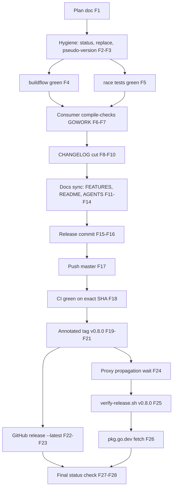

# v0.8.0 Release Plan — linter-autoconfigure-sdk

**Planned:** 2026-10-03 01:40 · **Release:** v0.8.0 (minor, 0.x)
**Driver:** user decision after the 2026-10-03 toolsdk audit session
**Format note:** `.md` + mermaid at the user's explicit demand (overrides the
pareto-planning skill's HTML default for this artifact only).

## What ships in v0.8.0

Since v0.7.0 the tree gained exactly one code change and one dep change:

1. **Fixed (the release driver):** nil-context panic in derived provider
   capabilities — `Repair(nil)` (and Detect/HealthCheck) on specs from
   `BootstrapProviderFromSpec`/`ProviderFromSpec` panicked inside
   `toolsdk.DryRunFromContext` (bootstrap.go:219 pre-fix). All five derived
   entry points now normalize via `toolsdk.EnsureContext`; consumer closures
   never observe a nil ctx. Reproduced against released v0.7.0; regression
   tests `TestBootstrapNilContext` +
   `TestProviderFromSpec_NilContext_NormalizedBeforeClosures`.
2. **Changed:** go-finding/toolsdk floor v1.13.0 → v1.14.0 (+ indirect
   go-error-family v0.11.0).

**Why minor, not patch:** the fix comes with a NEW behavioral guarantee
(standalone callers may pass nil ctx to every derived capability — a
documented contract, godoc + README + FEATURES), plus dependency floor
movement. In 0.x that is a minor bump. User confirmed v0.8.0.

**Explicitly OUT of scope (no verschlimmbessern):** T22 bridge fields,
Options bridging, consumer-repo fixes (go-version WorkingDir/Inputs), CI
buildflow job (T21), ErrNoRepair removal (T20, v1).

## Pareto breakdown

### The 1% that deliver 51%

The mechanical release spine — without these nothing ships:

| #    | Task                                            | Why it is the 1%                          |
| ---- | ----------------------------------------------- | ----------------------------------------- |
| 1.1  | Cut CHANGELOG `[0.8.0] - 2026-10-03`            | The version's public identity             |
| 1.2  | Commit release prep (detailed message) + push   | Tag must point at a commit with ALL changes |
| 1.3  | Annotated tag `v0.8.0` on the CI-green commit   | Tags are immutable — the one-shot step    |
| 1.4  | `gh release create --latest` (NO `--prerelease`) | 422 gotcha verified live at v0.3.1       |

### The 4% that deliver 64%

The failure-mode killers — each guards a historically real disaster:

| #    | Task                                                     | Failure it prevents                                  |
| ---- | -------------------------------------------------------- | ---------------------------------------------------- |
| 2.1  | Pre-tag gates: buildflow green, `go test -race`          | Shipping red code on an immutable tag               |
| 2.2  | Consumer compile-check (GOWORK vs oxlint + go-version)   | v0.4.0 lesson: bug found only post-tag              |
| 2.3  | CI green on the EXACT commit before tagging              | Red tag-CI is permanent                             |
| 2.4  | Post-tag `./scripts/verify-release.sh v0.8.0`            | Proxy/checksum/clean-dir `go get` regressions       |
| 2.5  | Replace/pseudo-version grep on go.mod                    | Pseudo-version poisoning (most common broken release)|

### The 20% that deliver 80%

Release-quality documentation and curation:

| #    | Task                                                     | Value                                                |
| ---- | -------------------------------------------------------- | ---------------------------------------------------- |
| 3.1  | FEATURES.md: nil-ctx guarantee row (BuildFlow section)   | Honest inventory; flagged missing by status report   |
| 3.2  | README: nil-ctx contract line in provider section        | Compile-guarded by readme_snippets_test.go           |
| 3.3  | AGENTS.md: release history line for v0.8.0               | Session orientation for future agents               |
| 3.4  | CHANGELOG "Changed" entry for the toolsdk floor bump     | Status-report item 20, decided: yes                 |
| 3.5  | Curated GitHub release notes (user-focused)              | The face of the release                              |

### The other 20% (to 100%)

| #    | Task                                                     | Value                                                |
| ---- | -------------------------------------------------------- | ---------------------------------------------------- |
| 4.1  | This plan doc committed + pushed                          | Audit trail; paste requirement                       |
| 4.2  | pkg.go.dev fetch trigger after proxy serves the tag       | Docs availability (lag expected — proxy is truth)   |
| 4.3  | Unreleased placeholders reset verification               | Phase 8.1 of go-release skill                        |
| 4.4  | Post-release notes: next-train routing (T22, consumers)   | Not executed — recorded                              |

## Medium-granularity plan (30–100 min each, sorted by importance → impact → effort → customer value)

| ID  | Task                                                               | Imp | Eff | Customer value | Est      |
| --- | ------------------------------------------------------------------ | --- | --- | -------------- | -------- |
| M1  | CHANGELOG cut + Changed entry + Unreleased reset                   | 10  | S   | Version truth  | 30 min   |
| M2  | Docs sync: FEATURES row, README contract line, AGENTS history      | 8   | S   | Trust/docs     | 45 min   |
| M3  | Pre-tag gates: buildflow + race tests + go.mod hygiene greps       | 9   | S   | Reliability    | 30 min   |
| M4  | Consumer compile-check via GOWORK (oxlint + go-version vs tree)    | 8   | M   | No breakage    | 45 min   |
| M5  | Release commit (detailed msg) + push + CI-green wait on exact SHA  | 10  | M   | Everything     | 60 min   |
| M6  | Annotated tag v0.8.0 + verify points-at + push tag                 | 10  | S   | Everything     | 30 min   |
| M7  | GitHub release (curated notes, --latest, no --prerelease)          | 8   | S   | Face of release| 30 min   |
| M8  | verify-release.sh + pkg.go.dev trigger + plan-doc commit/push      | 8   | S   | Proof          | 45 min   |

## Fine-granularity plan (≤12 min each, execution order)

| #   | Task                                                              | ≤ min | Depends on |
| --- | ----------------------------------------------------------------- | ----- | ---------- |
| F1  | Write this plan doc                                               | 12    | —          |
| F2  | `git status` clean check; daemon state noted                      | 2     | —          |
| F3  | `grep '^replace' go.mod` + `grep 00010101` hygiene                | 2     | —          |
| F4  | buildflow plain run (expect 17 known advisories, exit 0)          | 4     | —          |
| F5  | `go test -race -count=1 ./...` (incl. readme snippets guard)      | 8     | —          |
| F6  | GOWORK compile-check: oxlint-auto-configure ./...                 | 8     | F3         |
| F7  | GOWORK compile-check: go-version-auto-configure ./...             | 8     | F3         |
| F8  | CHANGELOG: [Unreleased]→[0.8.0] - 2026-10-03                      | 4     | F4,F5      |
| F9  | CHANGELOG: add Changed dep-floor entry                            | 3     | F8         |
| F10 | CHANGELOG: reset Unreleased placeholders                          | 2     | F9         |
| F11 | FEATURES.md: nil-ctx guarantee row                                | 5     | —          |
| F12 | README: nil-ctx contract line (snippet-guarded section)           | 6     | —          |
| F13 | AGENTS.md: release history line v0.8.0                            | 3     | —          |
| F14 | Re-run readme snippet test after README edit                      | 4     | F12        |
| F15 | Full `git status` + review diff of release prep                   | 4     | F8-F14     |
| F16 | Detailed release-prep commit (+ plan doc)                         | 6     | F15        |
| F17 | `git push origin master`                                          | 3     | F16        |
| F18 | `gh run list` / watch until green on the exact release SHA        | 10    | F17        |
| F19 | `git tag -a v0.8.0` with key-changes message                      | 4     | F18        |
| F20 | `git tag --points-at HEAD` + `git show v0.8.0:go.mod` sanity      | 3     | F19        |
| F21 | `git push origin v0.8.0`                                          | 3     | F20        |
| F22 | Draft /tmp/release-notes-v0.8.0.md (user-focused)                 | 8     | F9         |
| F23 | `gh release create v0.8.0 --latest --notes-file` (NO prerelease)  | 5     | F21,F22    |
| F24 | Wait 2–10 min: proxy propagation                                 | 10    | F21        |
| F25 | `./scripts/verify-release.sh v0.8.0` (proxy+get+API smoke)        | 10    | F24        |
| F26 | pkg.go.dev fetch trigger                                         | 3     | F25        |
| F27 | `gh run list` final CI check at tag                              | 3     | F21        |
| F28 | Final `git status`; verify daemon did not orphan files            | 2     | F23-F27    |

## Execution graph

## Risk register (from go-release skill + repo history)

- **Tags immutable.** Any botch → v0.8.1, never re-tag.
- **`--prerelease` + `--latest` = HTTP 422** (verified live at v0.3.1): drop
  the flag entirely even for v0.x.
- **pkg.go.dev 404 lag** after proxy serve: expected; proxy is source of truth.
- **Daemon commit races**: verify the release commit contains ALL prep
  (F15/F20) before pushing the tag.
- **Non-direnv shell gotcha**: buildflow needs the GOTOOLCHAIN-unset + go-1.27
  PATH recipe from AGENTS.md.

## Post-release (recorded, not executed in this train)

- T22 decision + implementation (bridge fields) → next minor.
- Consumer bumps (go-ecosystem-upgrade skill): oxlint, go-version, BuildFlow
  indirect pin.
- BuildFlow vendor refresh of both consumer providers after their releases.
