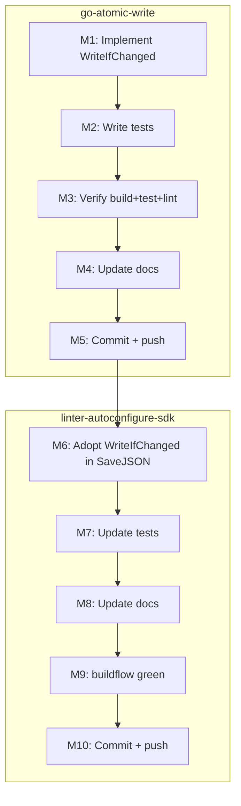

# Plan: Add `WriteIfChanged` to go-atomic-write + Adopt in linter-autoconfigure-sdk

**Date:** 2026-07-26 09:48
**Scope:** Two repos — improve `go-atomic-write` API, then consume it in `linter-autoconfigure-sdk`.
**Goal:** The missing primitive `WriteIfChanged` — write only if content differs. Composes existing `FingerprintFile` + `WriteVerified`. No new machinery, no new deps.

---

## 0. Problem Statement

`go-atomic-write` has three write modes:

- `Write` — always write (no TOCTOU check)
- `WriteVerified` — write with fingerprint race-check
- `WriteFunc` / `WriteFuncVerified` — streaming variants

**Missing:** "write only if content differs from disk." This is what every config writer and code generator needs — re-running an auto-configurer must not produce spurious diffs if nothing changed. Currently consumers must hand-roll: `FingerprintFile` → compare → `Write`. That logic belongs in the library.

**The RAM-fingerprint insight:** The caller has the new content in memory. `FingerprintFromBytes(newData)` compared against `FingerprintFile(path)` tells us whether a write is needed. If yes, we hand the _existing_ fingerprint to `WriteVerified` for race-safety.

---

## 0.1 Known issue surfaced during implementation (NOT fixed in this pass)

`WriteVerified(path, data, Fingerprint{})` — the documented first-write path — is **broken**. `commitVerified` acquires `flock.New(path).Lock()`, which creates the file, _before_ the zero-fingerprint `os.Stat` check. The stat then always sees the file as existing and returns a false `ErrConcurrentModification ("was created concurrently")`.

`WriteIfChanged` is unaffected: its first-write branch routes to plain `Write`, not `WriteVerified`. Fixing `commitVerified` means reordering lock-vs-stat (or using a non-creating lock probe) and is a behavioral change to a public error path. Out of scope here — tracked for a separate, deliberate fix. _[Fixed upstream in go-atomic-write v0.5.1: the stat check now runs before the creating lock.]_

---

## 1. Design

```go
func WriteIfChanged(path string, data []byte) (changed bool, err error)
```

- Reads existing fingerprint via `FingerprintFile` (zero if file doesn't exist)
- Compares `FingerprintFromBytes(data)` against existing
- If equal → skip, return `changed=false`
- If different → `WriteVerified(path, data, existing)` → return `changed=true`
- Race-safe: `WriteVerified` catches concurrent modification between fingerprint and rename
- Zero fingerprint (first write) correctly means "file must not exist yet"

**Explicitly NOT added (VERSCHLIMMBESSER avoidance):**

- `WriteFuncIfChanged` — streaming + content comparison is contradictory (need full content to fingerprint, defeats streaming)
- Options struct — function has 2 args, returns `(bool, error)`, no options needed
- `WriteIfChangedVerified` — `WriteIfChanged` IS verified by construction

---

## 2. Pareto Breakdown

### The 1% that delivers 51%

| #          | Task                                                                                 | Why                                                                                     |
| ---------- | ------------------------------------------------------------------------------------ | --------------------------------------------------------------------------------------- |
| ~~**P1**~~ | ~~Implement `WriteIfChanged` in `go-atomic-write/atomicwrite.go`~~ done at `13b34c5` | ~~The core primitive. Composes 2 existing functions. Everything else depends on this.~~ |

### The 4% that delivers 64%

| #          | Task                                                                                | Why                                                                                                                                            |
| ---------- | ----------------------------------------------------------------------------------- | ---------------------------------------------------------------------------------------------------------------------------------------------- |
| ~~**P2**~~ | ~~Comprehensive tests for `WriteIfChanged`~~ done at `13b34c5`                      | ~~Proves correctness: new file, same content skip, different content write, empty file edge case, permission preservation, no leftover files~~ |
| ~~**P3**~~ | ~~Adopt `WriteIfChanged` in `linter-autoconfigure-sdk/SaveJSON`~~ done at `c5d84b1` | ~~The consumer that needs it. Replaces hand-rolled atomic write + fixes missing fsync bug.~~                                                   |

### The 20% that delivers 80%

| #          | Task                                                                                                                                  | Why                                    |
| ---------- | ------------------------------------------------------------------------------------------------------------------------------------- | -------------------------------------- |
| ~~**P4**~~ | ~~Update go-atomic-write docs: CHANGELOG `[Unreleased]`, README API section, AGENTS.md structure table~~ done at `13b34c5`            | ~~Library must document its own API~~  |
| ~~**P5**~~ | ~~Update linter-autoconfigure-sdk: tests for new SaveJSON signature, README, CHANGELOG, AGENTS.md dependency list~~ done at `c5d84b1` | ~~Consumer docs must reflect new dep~~ |
| ~~**P6**~~ | ~~Final verification: build + test + lint both repos green~~ done — verified green again 2026-09-09                                   | ~~Proves end-to-end correctness~~      |

### Remaining 20% (to reach 100%)

| #          | Task                                                         | Why                         |
| ---------- | ------------------------------------------------------------ | --------------------------- |
| ~~**P7**~~ | ~~Commit + push go-atomic-write~~ done at `13b34c5`          | ~~Ship the library change~~ |
| ~~**P8**~~ | ~~Commit + push linter-autoconfigure-sdk~~ done at `0b6f0f1` | ~~Ship the adoption~~       |

---

## 3. Medium-Granularity Plan (30-100 min tasks)

Sorted by dependency order.

| ID      | Task                                                                                      | Pareto     | Impact       | Effort    | Depends on | Status      |
| ------- | ----------------------------------------------------------------------------------------- | ---------- | ------------ | --------- | ---------- | ----------- |
| ~~M1~~  | ~~Implement `WriteIfChanged` in `atomicwrite.go`~~ done at `13b34c5`                      | ~~1%~~     | ~~Critical~~ | ~~30min~~ | ~~—~~      | ~~pending~~ |
| ~~M2~~  | ~~Write tests for `WriteIfChanged` in `atomicwrite_test.go`~~ done at `13b34c5`           | ~~4%~~     | ~~High~~     | ~~45min~~ | ~~M1~~     | ~~pending~~ |
| ~~M3~~  | ~~Verify go-atomic-write: build + vet + test + lint green~~ done at `13b34c5`             | ~~4%~~     | ~~High~~     | ~~30min~~ | ~~M2~~     | ~~pending~~ |
| ~~M4~~  | ~~Update go-atomic-write docs (CHANGELOG, README, AGENTS.md)~~ done at `13b34c5`          | ~~20%~~    | ~~Medium~~   | ~~30min~~ | ~~M3~~     | ~~pending~~ |
| ~~M5~~  | ~~Commit + push go-atomic-write~~ done at `13b34c5`                                       | ~~20%~~    | ~~High~~     | ~~15min~~ | ~~M4~~     | ~~pending~~ |
| ~~M6~~  | ~~Adopt `WriteIfChanged` in linter-autoconfigure-sdk `SaveJSON`~~ done at `c5d84b1`       | ~~4%~~     | ~~High~~     | ~~45min~~ | ~~M5~~     | ~~pending~~ |
| ~~M7~~  | ~~Update linter-autoconfigure-sdk tests for new SaveJSON signature~~ done at `c5d84b1`    | ~~20%~~    | ~~High~~     | ~~45min~~ | ~~M6~~     | ~~pending~~ |
| ~~M8~~  | ~~Update linter-autoconfigure-sdk docs (README, CHANGELOG, AGENTS.md)~~ done at `c5d84b1` | ~~20%~~    | ~~Medium~~   | ~~30min~~ | ~~M7~~     | ~~pending~~ |
| ~~M9~~  | ~~Final verification: buildflow green in linter-autoconfigure-sdk~~ done at `c5d84b1`     | ~~rem20%~~ | ~~Critical~~ | ~~30min~~ | ~~M8~~     | ~~pending~~ |
| ~~M10~~ | ~~Commit + push linter-autoconfigure-sdk~~ done at `0b6f0f1`                              | ~~rem20%~~ | ~~High~~     | ~~15min~~ | ~~M9~~     | ~~pending~~ |

---

## 4. Fine-Granularity Plan (max 12 min each)

| ID      | Sub-task                                                                                                  | Parent  | Est       | Status      |
| ------- | --------------------------------------------------------------------------------------------------------- | ------- | --------- | ----------- |
| ~~F1~~  | ~~Add `WriteIfChanged` function + godoc after `WriteVerified` in `atomicwrite.go`~~ done at `13b34c5`     | ~~M1~~  | ~~8min~~  | ~~pending~~ |
| ~~F2~~  | ~~Verify it compiles: `go build ./...` in go-atomic-write~~ done at `13b34c5`                             | ~~M1~~  | ~~2min~~  | ~~pending~~ |
| ~~F3~~  | ~~Add `TestWriteIfChanged_NewFile` — no existing file → changed=true, content correct~~ done at `13b34c5` | ~~M2~~  | ~~8min~~  | ~~pending~~ |
| ~~F4~~  | ~~Add `TestWriteIfChanged_SameContent` — same data → changed=false, no write~~ done at `13b34c5`          | ~~M2~~  | ~~8min~~  | ~~pending~~ |
| ~~F5~~  | ~~Add `TestWriteIfChanged_DifferentContent` — different data → changed=true~~ done at `13b34c5`           | ~~M2~~  | ~~5min~~  | ~~pending~~ |
| ~~F6~~  | ~~Add `TestWriteIfChanged_EmptyFile_EmptyData` — edge case → changed=false~~ done at `13b34c5`            | ~~M2~~  | ~~5min~~  | ~~pending~~ |
| ~~F7~~  | ~~Add `TestWriteIfChanged_PermissionPreserved` — existing perms kept~~ done at `13b34c5`                  | ~~M2~~  | ~~8min~~  | ~~pending~~ |
| ~~F8~~  | ~~Add `TestWriteIfChanged_LeavesNoLeftoverFiles` — no .tmp files~~ done at `13b34c5`                      | ~~M2~~  | ~~5min~~  | ~~pending~~ |
| ~~F9~~  | ~~Run `go test -race -count=1 ./...` in go-atomic-write~~ done at `13b34c5`                               | ~~M3~~  | ~~3min~~  | ~~pending~~ |
| ~~F10~~ | ~~Run `golangci-lint run ./...` in go-atomic-write — must be 0 issues~~ done at `13b34c5`                 | ~~M3~~  | ~~5min~~  | ~~pending~~ |
| ~~F11~~ | ~~Update `CHANGELOG.md` `[Unreleased]` — add WriteIfChanged under Added~~ done at `13b34c5`               | ~~M4~~  | ~~5min~~  | ~~pending~~ |
| ~~F12~~ | ~~Update `README.md` — add WriteIfChanged to API section + use case~~ done at `13b34c5`                   | ~~M4~~  | ~~8min~~  | ~~pending~~ |
| ~~F13~~ | ~~Update `AGENTS.md` structure table — add WriteIfChanged to atomicwrite.go row~~ done at `13b34c5`       | ~~M4~~  | ~~3min~~  | ~~pending~~ |
| ~~F14~~ | ~~`git status` + review diff in go-atomic-write~~ done at `13b34c5`                                       | ~~M5~~  | ~~3min~~  | ~~pending~~ |
| ~~F15~~ | ~~Commit + push go-atomic-write~~ done at `13b34c5`                                                       | ~~M5~~  | ~~8min~~  | ~~pending~~ |
| ~~F16~~ | ~~Add `go-atomic-write` to `go.mod` (via `go get` pseudo-version from master)~~ done at `c5d84b1`         | ~~M6~~  | ~~5min~~  | ~~pending~~ |
| ~~F17~~ | ~~Rewrite `SaveJSON` to use `atomicwrite.WriteIfChanged`~~ done at `c5d84b1`                              | ~~M6~~  | ~~10min~~ | ~~pending~~ |
| ~~F18~~ | ~~Remove dead code: `os.CreateTemp`, `os.Chmod`, `os.Rename` hand-rolled logic~~ done at `c5d84b1`        | ~~M6~~  | ~~5min~~  | ~~pending~~ |
| ~~F19~~ | ~~Update `SaveJSON` tests for new atomic-write behavior~~ done at `c5d84b1`                               | ~~M7~~  | ~~10min~~ | ~~pending~~ |
| ~~F20~~ | ~~Run `go test -race -count=1 ./...` in linter-autoconfigure-sdk~~ done at `c5d84b1`                      | ~~M7~~  | ~~3min~~  | ~~pending~~ |
| ~~F21~~ | ~~Update linter-autoconfigure-sdk `CHANGELOG.md`~~ done at `1c72b36`                                      | ~~M8~~  | ~~5min~~  | ~~pending~~ |
| ~~F22~~ | ~~Update linter-autoconfigure-sdk `README.md` API table~~ done at `1818692`                               | ~~M8~~  | ~~8min~~  | ~~pending~~ |
| ~~F23~~ | ~~Update linter-autoconfigure-sdk `AGENTS.md` — new dependency~~ done at `c5d84b1`                        | ~~M8~~  | ~~5min~~  | ~~pending~~ |
| ~~F24~~ | ~~Run `buildflow` in linter-autoconfigure-sdk — must be green~~ done at `c5d84b1`                         | ~~M9~~  | ~~5min~~  | ~~pending~~ |
| ~~F25~~ | ~~`git status` + review diff in linter-autoconfigure-sdk~~ done at `c5d84b1`                              | ~~M10~~ | ~~3min~~  | ~~pending~~ |
| ~~F26~~ | ~~Commit + push linter-autoconfigure-sdk~~ done at `0b6f0f1`                                              | ~~M10~~ | ~~8min~~  | ~~pending~~ |

---

## 5. Execution Graph (Mermaid)



---

## Resolution (2026-09-09, docs-health pass)

Fully executed. All P, M, and F rows resolved inline (10 M + 26 F + 8 P):
go-atomic-write side shipped and pushed as `13b34c5` (later tagged through
v0.5.1, with the §0.1 `WriteVerified` first-write bug fixed); SDK side shipped
in `c5d84b1` and pushed as `0b6f0f1`, with docs following (`1c72b36`,
`1818692`). Every task status above said "pending" at execution time — that
staleness was itself reported by the 2026-07-26_10-19 status report (b3) and is
now resolved by these markers. Archived: plan complete.
